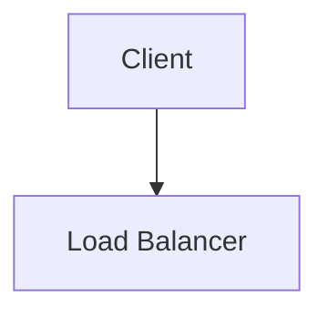

**Features:** `Markdown` in Typora(local) -> `HTML` in GitHub Page(online)

---

---

---

<div align="middle"><iframe frameborder="no" border="0" marginwidth="0" marginheight="0" width=330 height=86 src="https://music.163.com/outchain/player?type=2&id=18309776&auto=1&height=66"></iframe></div>

# H1

## H2

### H3

#### H4

##### H5

###### H6

## H2

## h2

**Bold** *Italic* <u>underline</u> ~~delete~~

>   Think more, code less.

- unordered list
- unordered list

1.  ordered list
    -   unordered list inside
    -   unordered list inside
2.  ordered list
    -   unordered list inside
    -   unordered list inside

| Left | Middle | Right |
| ---- | :----: | ----: |
| 11   |   12   |    13 |
| 21   |   22   |    23 |
| 31   |   32   |    33 |

[Link to My GitHub](https://github.com/bill-xia)

This is a footnote[^footnote].

`This is Inline Code`

$\LaTeX$ supported by **MathJax**: \\(e^{\ln x}=x\\) 

$$\nabla\cdot\mathbf{B}=\rho_m$$

$$\nabla\times\mathbf{E}=-\left(\mathbf{j_0}+\frac{\partial\mathbf{B}}{\partial t}\right)$$

Testing macros through the whole file:

$$
\newcommand{\D}[1]{\mathrm{d}#1}

\newcommand{\npartial}[2]{\dfrac{\partial #1}{\partial #2}}
\newcommand{\noint}[1]{\oint\limits_{(#1)}}
\newcommand{\noiint}[1]{\oiint\limits_{(#1)}}
\newcommand{\niint}[1]{\iint\limits_{(#1)}}
\newcommand{\niiint}[1]{\iiint\limits_{(#1)}}


\noint{+C}P\D{x}+Q\D{y}=
\niint{\sigma}\left(\npartial{Q}{x}-\npartial{P}{y}\right)\D{\sigma}
\tag{Green}
$$

$$
\noiint{S}\vec{A}\cdot\D{\vec{S}}=\niiint{V}\nabla\cdot\vec{A}~\D{V}
\tag{Gauss}
$$

$$
\noint{C}\vec{A}\cdot\D{\vec{s}}=
\niint{\sigma}\left(\nabla\times\vec{A}\right)\cdot\D{\vec{S}}
\tag{Stokes}
$$

`flowchart.js`

```flow
st=>start: Start:>http://www.google.com[blank]
e=>end:>http://www.google.com
op1=>operation: My Operation
sub1=>subroutine: My Subroutine
cond=>condition: Yes
or No?:>http://www.google.com
io=>inputoutput: catch something...
para=>parallel: parallel tasks

st->op1->cond
cond(yes)->io->e
cond(no)->para
para(path1, bottom)->sub1(right)->op1
para(path2, top)->op1
```

`mermaid`



`sequence-diagram`

```sequence
Andrew->China: Says Hello
Note right of China: China thinks\nabout it
China-->Andrew: How are you?
Andrew->>China: I am good thanks!
```

```c++
// C++ Code Snippet
#include <iostream>
using namespace std;

int main()
{
    for (int i = 0; i < 5; i++)
    {
        cout << "Hello, world!" << endl;
    }
    return 0;
}
```

```python
# Python Code Snippet (with yapf formatted)

import this


def main():
    for _ in range(0, 5):
        print("Hello, World!")


if __name__ == "__main__":
    main()

```

```java
// Java Code Snippet
public class Main {
    public static void main(String[] args) {
        for (int i = 0; i < 5; i++) {
            System.out.println("Hello, world!");
        }
    }
}
```

```javascript
// Javascript Code Snippet
for (i = 0; i < 5; i++) {
    console.log("Hello, world!");
}
```

**emoji:** 😀 :grinning: 

[^footnote]: you could get back!

